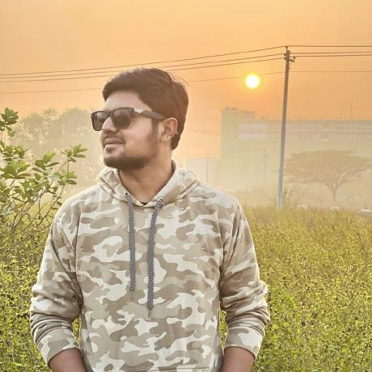

................................

## About Me
Hello there I'm **Sharif Ahmed** , currently learning Web Development Under an open course of favorite instructor Sir **Anisul Islam** . I'm Currently studying in Department of Computer Science And Engineering at **United International University**. I'm a tech enthusiast and love to know about the tech affairs all over the world.

## Skills
1. ### Markup Languages
   + HTML 
   + CSS 
2. ### Programming Languages   
   + C
   + Java
   + JavaScript(Tring to learn)
3. ### Graphics
   + Adobe Premier Pro
   + Adobe PhotoShop & After Effect

## Academic Qualifications
+ SSC : GPA 5.00
+ HSC : GPA 5.00 
+ BSC in Food And Process Engineering (HSTU)
+ Bsc in Computer Science & Engineering, running (UIU)

## Contacts
<button> [Facebook](https://www.facebook.com/s.ahmd02/) </button> <button> [Instagram](https://www.facebook.com/s.ahmd02/) </button> <button> [Gmail](sharif.ahmed.cse2@gmail.com) </button>     

@All rights reserved by Sharif Ahmed